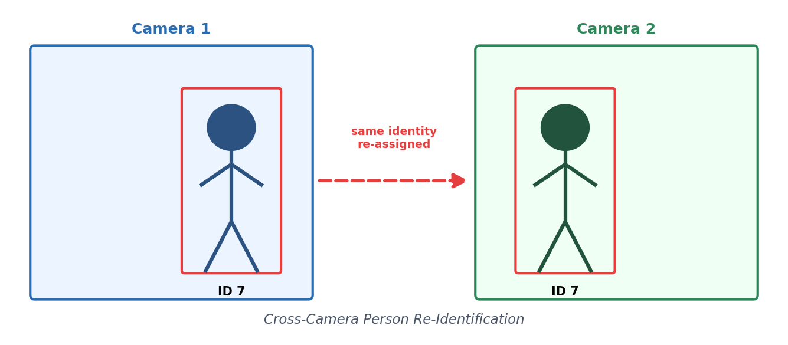

# Multi-Camera Person Tracking & Re-Identification

A learning project exploring multi-object tracking algorithms and cross-camera
person re-identification — recognizing the same person as they move from one
camera's field of view into another's.



## 1. Single-Camera Tracking

Five tracker variants were implemented and compared to understand the
tradeoffs between motion-only, appearance-integrated, and hybrid approaches
to identity association — particularly how each handles occlusion and a
person leaving/re-entering the frame.

| Tracker                                | Approach                                                                                                                                         |
| -------------------------------------- | ------------------------------------------------------------------------------------------------------------------------------------------------ |
| **ByteTrack**                          | Motion-only, two-stage (high/low confidence) association                                                                                         |
| **ByteTrack + ReID** (`bytetrack_pro`) | ByteTrack + a manual OSNet-based gallery layered on top, so identity survives full occlusion/re-entry, not just ByteTrack's short `track_buffer` |
| **DeepSORT**                           | Motion (Kalman/IoU) + appearance embedding cascade matching                                                                                      |
| **BoT-SORT**                           | ByteTrack + camera motion compensation + optional ReID branch                                                                                    |
| **OC-SORT**                            | Robust motion-only Kalman formulation, no appearance model                                                                                       |

**Run:**

```bash
python main.py --tracker <bytetrack|bytetrack_pro|botsort|deepsort|ocsort>
```

## 2. Cross-Camera Re-Identification

**Goal:** assign the same global ID to a person as they cross from one
camera's view into another's — since local track IDs reset independently
per camera, this needs a separate appearance-matching layer on top of
whichever tracker is running.

**Method:**

- Each camera runs its own tracker instance, producing local track IDs.
- A shared **OSNet** (Market1501, multi-source domain generalization
  weights) extracts an appearance embedding for every detected box.
- A `CrossCameraGallery` matches new tracks against currently out-of-view
  ("inactive") global identities via cosine similarity, assigning a shared
  global ID on a match or creating a new one otherwise.
- **Boundary-touch filtering**: a brand-new detection still touching the
  frame edge (e.g. a foot or shoulder entering frame) is not embedded or
  assigned an ID until fully inside the frame — this prevents a partial-body
  embedding from polluting the gallery and causing false non-matches.

**Run:**

```bash
python main.py --tracker bytetrack_reid
```

You'll be prompted for the number of camera/video sources and a path (webcam
index, video file, or RTSP URL) for each.

## Current Limitation

OSNet's appearance similarity degrades across different camera
angles/lighting conditions, which limits cross-camera matching accuracy.
This is the open problem going into the next phase — testing stronger
ReID backbones (AGW, TransReID, CLIP-ReID) that generalize better to
viewpoint and domain shift.

## Requirements

See `requirements.txt`.
